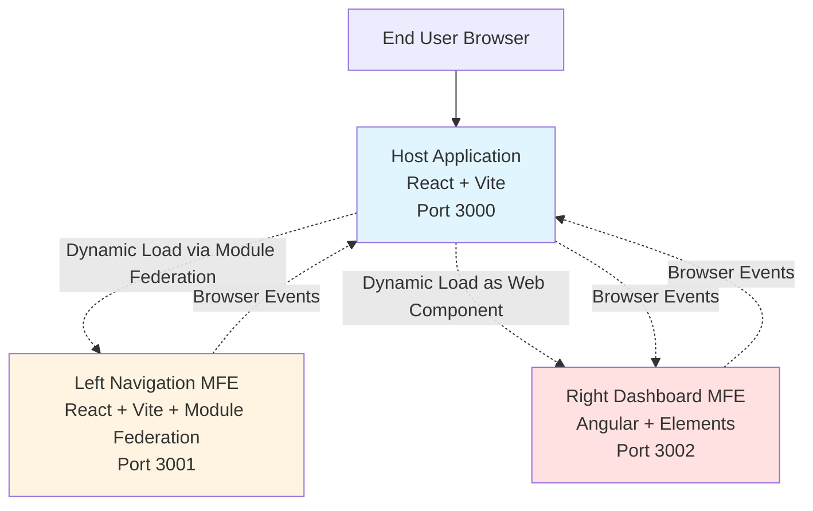
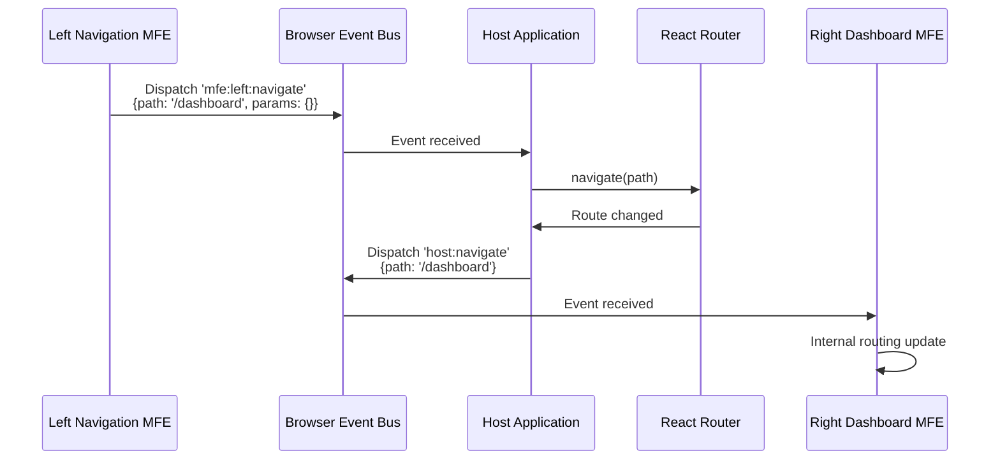
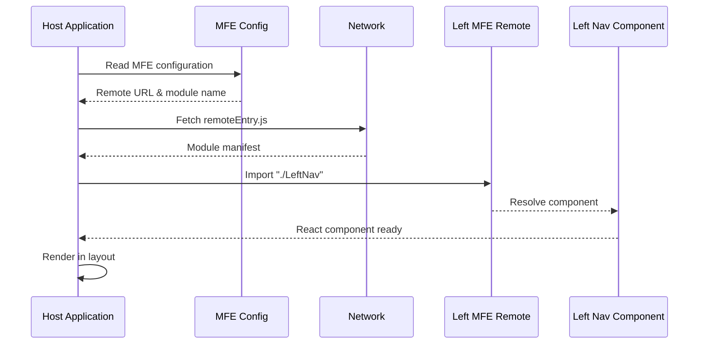
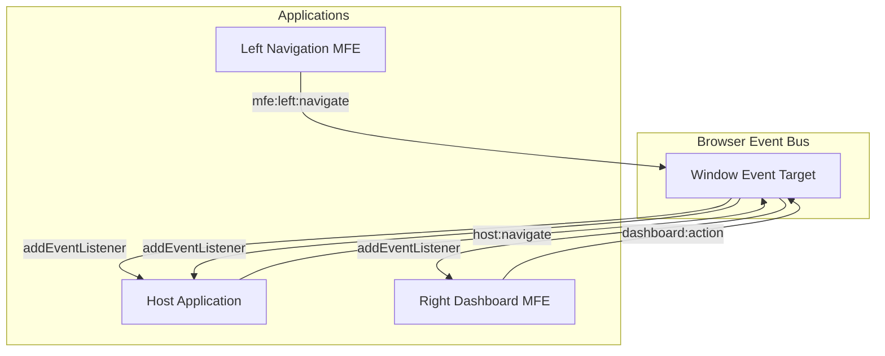
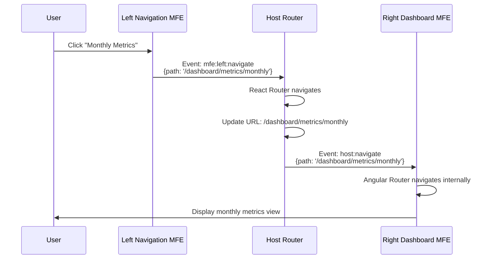

# Micro Frontend POC - Design Document

## Project Overview

### Purpose
Build a fully functional Micro Frontend (MFE) proof-of-concept demonstrating complete independence between three separate applications: a React Host, a React-based Left Navigation MFE, and an Angular-based Dashboard MFE. Each application operates as a standalone entity with its own build system, dependencies, and runtime environment.

### Strategic Goal
Validate the architectural feasibility of completely decoupled micro frontends where:
- Each MFE is independently developable, deployable, and maintainable
- Integration occurs purely at runtime through standardized browser APIs
- No build-time coupling or shared configuration exists
- Different framework ecosystems (React, Angular) coexist seamlessly

### Core Principles
1. **Complete Independence**: Each application maintains its own package.json, build pipeline, and dependency tree
2. **Runtime Integration**: MFEs communicate exclusively through browser events and dynamic module loading
3. **Framework Agnostic**: Host can consume MFEs regardless of underlying framework
4. **Deployment Flexibility**: Each MFE can be deployed to different servers/origins independently

## Architecture Overview

### System Context



### Application Structure

The system consists of three completely independent applications:

| Application | Framework | Port | Integration Method | Independence Level |
|------------|-----------|------|-------------------|-------------------|
| Host | React 18+ with Vite | 3000 | Module Federation Consumer + Web Component Host | Fully Independent |
| Left Navigation MFE | React 18+ with Vite | 3001 | Module Federation Producer | Fully Independent |
| Right Dashboard MFE | Angular 15+ | 3002 | Angular Elements (Web Component) | Fully Independent |

### Repository Organization

```
mfe-poc-workspace/
├── mfe-host/                    # Independent React Host Application
│   ├── package.json
│   ├── vite.config.ts
│   ├── tsconfig.json
│   ├── src/
│   └── README.md
│
├── mfe-leftnav/                 # Independent React MFE
│   ├── package.json
│   ├── vite.config.ts
│   ├── tsconfig.json
│   ├── src/
│   └── README.md
│
└── mfe-dashboard-angular/       # Independent Angular MFE
    ├── package.json
    ├── angular.json
    ├── tsconfig.json
    ├── src/
    └── README.md
```

**Critical Rule**: No root-level package.json, shared configuration files, or common scripts. Each directory is a completely standalone Node.js project.

## Application Designs

### 1. Host Application (mfe-host)

#### Purpose
Serves as the main container that dynamically loads and orchestrates micro frontends. Acts as the routing authority and event coordinator.

#### Technical Approach
- **Build Tool**: Vite with Module Federation plugin (@originjs/vite-plugin-federation)
- **Routing**: React Router v6 for client-side routing
- **MFE Loading**: Dynamic remote module loading + Web Component embedding

#### Functional Responsibilities

| Responsibility | Implementation Strategy |
|---------------|------------------------|
| Route Management | Define routes `/home` and `/dashboard` with nested route support |
| MFE Discovery | Load MFEs from runtime configuration (URL-based) |
| Event Coordination | Listen for `mfe:left:navigate` events and trigger routing |
| State Distribution | Pass data to Right MFE via custom element attributes or events |
| Error Handling | Display fallback UI when MFE loading fails |
| Layout Management | Provide container structure for Left and Right MFEs |

#### Configuration Structure

The Host maintains a runtime configuration for MFE discovery:

| Configuration Field | Purpose | Example Value |
|-------------------|---------|---------------|
| Remote Name | Identifier for Module Federation remote | "leftNav" |
| Remote URL | Location of remoteEntry.js | "http://localhost:3001/assets/remoteEntry.js" |
| Exposed Module | Module path to import | "./LeftNav" |
| Web Component URL | Script URL for Angular MFE | "http://localhost:3002/main.js" |
| Web Component Tag | Custom element tag name | "right-dashboard" |

#### Routing Architecture

```mermaid
graph LR
    Root[/ Root] --> Home[/home]
    Root --> Dashboard[/dashboard]
    Dashboard --> Metrics[/dashboard/metrics]
    Metrics --> Period[/dashboard/metrics/:period]
    
    Home -.->|Displays| LeftNav[Left Navigation MFE]
    Dashboard -.->|Displays| Both[Left Nav + Right Dashboard]
```

#### Event Flow - Navigation Handling



#### Fallback Strategy

When MFE fails to load:
- Display user-friendly error message
- Provide retry mechanism
- Log error details for debugging
- Continue functioning with available MFEs

---

### 2. Left Navigation MFE (mfe-leftnav)

#### Purpose
Provides reusable navigation component exposed via Module Federation. Operates independently with its own dev server and build process.

#### Technical Approach
- **Build Tool**: Vite with Module Federation plugin
- **Exposure Strategy**: Export both standalone App and LeftNav component
- **Communication**: Browser CustomEvent API

#### Functional Responsibilities

| Responsibility | Implementation Strategy |
|---------------|------------------------|
| Navigation UI | Render hierarchical navigation menu with dummy data |
| User Interaction | Handle click events on navigation items |
| Event Emission | Dispatch `mfe:left:navigate` with path and parameters |
| Nested Routing | Support internal routes: `/nav`, `/nav/settings`, `/nav/profile` |
| Standalone Mode | Function independently at http://localhost:3001 |

#### Module Federation Configuration

| Aspect | Configuration |
|--------|---------------|
| Application Name | "leftNavMFE" |
| Exposed Modules | "./LeftNav" (component), "./App" (standalone entry) |
| Shared Dependencies | React, React-DOM (singleton: true) |
| Build Output | remoteEntry.js in dist/assets/ |

#### Navigation Data Structure

Example navigation items (dummy data):

| Level | Label | Route | Icon Suggestion |
|-------|-------|-------|-----------------|
| 1 | Home | /home | Home icon |
| 1 | Dashboard | /dashboard | Dashboard icon |
| 2 | Metrics | /dashboard/metrics | Chart icon |
| 3 | Daily | /dashboard/metrics/daily | Calendar icon |
| 3 | Monthly | /dashboard/metrics/monthly | Calendar icon |
| 1 | Settings | /nav/settings | Settings icon |
| 1 | Profile | /nav/profile | User icon |

#### Event Emission Pattern

When user clicks navigation item:

| Step | Action | Detail |
|------|--------|--------|
| 1 | Capture click event | Prevent default navigation |
| 2 | Extract route data | Get path, parameters from item data |
| 3 | Create CustomEvent | Event name: 'mfe:left:navigate' |
| 4 | Set event detail | { path: string, params: object } |
| 5 | Dispatch to window | window.dispatchEvent(event) |

#### Standalone Development

The Left MFE must support:
- Independent development at http://localhost:3001
- Full navigation functionality without Host
- Visual testing of navigation states
- Component-level development and testing

---

### 3. Right Dashboard MFE (mfe-dashboard-angular)

#### Purpose
Provides dashboard functionality as both a standalone Angular application and a distributable Web Component bundle. Demonstrates cross-framework integration.

#### Technical Approach
- **Framework**: Angular 15+ with Angular Elements
- **Build System**: Angular CLI with custom build scripts
- **Web Component**: Custom element registration using @angular/elements
- **Routing**: Angular Router for internal navigation

#### Functional Responsibilities

| Responsibility | Implementation Strategy |
|---------------|------------------------|
| Dashboard UI | Display dashboard with dummy data (charts, metrics, tables) |
| Nested Routing | Support routes: `/dashboard`, `/dashboard/metrics`, `/dashboard/metrics/:period` |
| Event Listening | Listen for `host:navigate` events from Host |
| Event Emission | Dispatch `dashboard:action` events back to Host |
| Web Component Bundle | Build single JS file for embedding in any HTML |
| Standalone Mode | Function independently at http://localhost:3002 |

#### Build Outputs

| Build Target | Command | Output | Purpose |
|-------------|---------|--------|---------|
| Development | ng serve | Dev server | Standalone development |
| Production | ng build | Standard Angular build | Full app deployment |
| Web Component | npm run build:wc | Single bundled JS file | Universal embedding |

#### Web Component Registration

The Angular MFE creates a custom element:

| Aspect | Specification |
|--------|---------------|
| Tag Name | `<right-dashboard>` |
| Registration Timing | On script load (IIFE) |
| Attributes Support | data-config, initial-route |
| Event Emission | Bubbles up from shadow DOM |
| Styling | Encapsulated via Shadow DOM |

#### Routing Structure

```mermaid
graph TB
    Root[/dashboard] --> Overview[Dashboard Overview]
    Root --> Metrics[/metrics]
    Metrics --> Daily[/metrics/daily]
    Metrics --> Weekly[/metrics/weekly]
    Metrics --> Monthly[/metrics/monthly]
    Metrics --> Dynamic[/metrics/:period]
```

#### Event Interaction Patterns

**Incoming Events (from Host):**

| Event Name | Payload | Response Action |
|-----------|---------|-----------------|
| host:navigate | { path: string, params: object } | Update internal Angular router |
| host:data:update | { data: any } | Update dashboard data |

**Outgoing Events (to Host):**

| Event Name | Payload | Trigger Condition |
|-----------|---------|-------------------|
| dashboard:action | { type: 'navigate', data: {path: string} } | User clicks internal link |
| dashboard:action | { type: 'export', data: {format: string} } | User exports data |
| dashboard:action | { type: 'refresh', data: {} } | User refreshes dashboard |

#### Dummy Dashboard Data

The dashboard displays:

| Widget Type | Data Example | Purpose |
|------------|--------------|---------|
| Metric Cards | Total Users: 1,234; Revenue: $56,789 | Key performance indicators |
| Line Chart | Monthly trend (Jan-Dec) | Visual time series |
| Data Table | Recent transactions (10 rows) | Detailed records |
| Status Indicators | System health: 98% uptime | Operational status |

---

## Integration Architecture

### Module Federation Strategy (Host ↔ Left MFE)

#### Configuration Approach

**Left MFE (Producer):**
- Exposes components via Vite Module Federation plugin
- Generates remoteEntry.js manifest file
- Declares shared dependencies (React, React-DOM)

**Host (Consumer):**
- Configures remote entry URL
- Dynamically imports exposed modules
- Shares React dependencies to avoid duplication

#### Loading Flow



#### Shared Dependency Strategy

| Dependency | Version Strategy | Singleton | Reason |
|-----------|------------------|-----------|--------|
| React | Host version controls | Yes | Prevent multiple React instances |
| React-DOM | Host version controls | Yes | Ensure single DOM reconciler |
| React-Router | Host version controls | Yes | Unified routing context |

---

### Web Component Strategy (Host ↔ Right MFE)

#### Integration Approach

The Angular MFE is loaded as a Web Component:

| Step | Action | Technical Detail |
|------|--------|------------------|
| 1 | Script Injection | Host dynamically creates `<script>` tag |
| 2 | Component Registration | Angular Elements registers custom element |
| 3 | Element Placement | Host inserts `<right-dashboard>` in DOM |
| 4 | Lifecycle Management | Custom element connects/disconnects |
| 5 | Event Wiring | Host attaches event listeners |

#### Attribute-Based Configuration

The Host can configure the Right MFE via attributes:

| Attribute | Type | Purpose | Example |
|-----------|------|---------|---------|
| data-config | JSON string | Pass configuration object | '{"theme": "dark"}' |
| initial-route | String | Set starting route | "/dashboard/metrics" |
| user-context | JSON string | Pass user information | '{"userId": "123"}' |

#### Isolation and Styling

| Aspect | Strategy | Benefit |
|--------|----------|---------|
| DOM Isolation | Shadow DOM (if supported) | Prevent style conflicts |
| Style Encapsulation | Scoped CSS or Shadow DOM styles | Independent theming |
| Global State | No shared state; events only | Clear boundaries |

---

## Cross-MFE Communication

### Event-Driven Architecture

All communication occurs through browser CustomEvent API:



### Event Contracts

#### Event: mfe:left:navigate

| Field | Type | Required | Description |
|-------|------|----------|-------------|
| event.type | string | Yes | "mfe:left:navigate" |
| event.detail.path | string | Yes | Target route path |
| event.detail.params | object | No | URL parameters or query strings |
| event.detail.state | object | No | Additional state to pass |

**Emitter**: Left Navigation MFE  
**Listener**: Host Application  
**Purpose**: Request route change when user clicks navigation item

---

#### Event: host:navigate

| Field | Type | Required | Description |
|-------|------|----------|-------------|
| event.type | string | Yes | "host:navigate" |
| event.detail.path | string | Yes | Route path to navigate to |
| event.detail.params | object | No | Route parameters |

**Emitter**: Host Application  
**Listener**: Right Dashboard MFE  
**Purpose**: Notify MFE of route changes initiated by Host

---

#### Event: dashboard:action

| Field | Type | Required | Description |
|-------|------|----------|-------------|
| event.type | string | Yes | "dashboard:action" |
| event.detail.type | string | Yes | Action type: 'navigate', 'export', 'refresh', etc. |
| event.detail.data | any | Yes | Action-specific payload |
| event.detail.timestamp | number | No | Event timestamp |

**Emitter**: Right Dashboard MFE  
**Listener**: Host Application  
**Purpose**: Notify Host of user actions within dashboard

---

### Communication Rules

1. **No Direct Coupling**: MFEs never import or reference each other's code
2. **Event-Only**: All data exchange occurs via CustomEvents
3. **Loosely Coupled**: MFEs don't assume other MFEs are present
4. **Backward Compatible**: Event structure changes must be additive
5. **Error Resilient**: Failed event dispatch or handling should not crash MFE

---

## Routing Strategy

### Host Routing Responsibility

The Host owns the primary routing logic:

| Route Pattern | MFEs Displayed | Layout |
|--------------|----------------|--------|
| / | Redirect to /home | N/A |
| /home | Left Navigation MFE only | Single column |
| /dashboard | Left Navigation + Right Dashboard | Two column |
| /dashboard/* | Left Navigation + Right Dashboard | Two column with nested view |

### Nested Routing Coordination



### Route Ownership Table

| Route Segment | Owner | Authority |
|--------------|-------|-----------|
| /home | Host | Full control |
| /dashboard | Host | Full control |
| /dashboard/metrics | Host (URL), Right MFE (content) | Shared |
| /dashboard/metrics/:period | Host (URL), Right MFE (content) | Shared |
| /nav/settings | Host (URL), Left MFE (content) | Shared |

**Strategy**: Host controls the browser URL. MFEs update internal routing based on events.

---

## Development Workflow

### Independent Development

Each application supports standalone development:

#### Left Navigation MFE Development

| Step | Command | Port | Access |
|------|---------|------|--------|
| Install | npm install | N/A | N/A |
| Dev Server | npm run dev | 3001 | http://localhost:3001 |
| Build | npm run build | N/A | Outputs to dist/ |
| Preview | npm run preview | Variable | Test production build |

**Independence**: Can develop, test, and build without Host or Right MFE running.

#### Right Dashboard MFE Development

| Step | Command | Port | Access |
|------|---------|------|--------|
| Install | npm install | N/A | N/A |
| Dev Server | npm start | 3002 | http://localhost:3002 |
| Build | npm run build | N/A | Outputs to dist/ |
| Build WC | npm run build:wc | N/A | Single JS bundle |

**Independence**: Fully functional Angular app without Host.

#### Host Development

| Step | Command | Port | Access |
|------|---------|------|--------|
| Install | npm install | N/A | N/A |
| Dev Server | npm run dev | 3000 | http://localhost:3000 |
| Build | npm run build | N/A | Outputs to dist/ |

**Dependency**: Requires Left and Right MFEs running on their ports for full integration testing.

### Full Integration Testing

To test the complete system:

| Terminal | Directory | Command | Purpose |
|----------|-----------|---------|---------|
| 1 | mfe-leftnav | npm run dev | Start Left MFE on port 3001 |
| 2 | mfe-dashboard-angular | npm start | Start Right MFE on port 3002 |
| 3 | mfe-host | npm run dev | Start Host on port 3000 |

Access http://localhost:3000 to see integrated application.

---

## Error Handling & Resilience

### MFE Loading Failures

#### Scenario: Remote Entry Fails to Load

| Phase | Handling Strategy |
|-------|------------------|
| Detection | Module Federation import promise rejection |
| User Feedback | Display error boundary with retry option |
| Fallback | Show static navigation or disable section |
| Logging | Log error details to console or monitoring service |

#### Scenario: Web Component Script Fails

| Phase | Handling Strategy |
|-------|------------------|
| Detection | Script onerror event |
| User Feedback | Display "Dashboard temporarily unavailable" |
| Fallback | Show cached data or placeholder |
| Retry | Implement exponential backoff retry logic |

### Event Communication Failures

| Failure Type | Detection | Mitigation |
|-------------|-----------|------------|
| Event not dispatched | N/A (fire-and-forget) | Design MFEs to function independently |
| No listener registered | N/A (no error thrown) | Ensure Host initializes listeners early |
| Malformed event payload | Listener validation logic | Validate payload structure; ignore invalid events |
| Event listener exception | Try-catch in listener | Log error; prevent cascade failures |

### Network Resilience

For production deployment:

| Concern | Solution |
|---------|----------|
| Remote MFE server down | Implement health checks; serve from CDN with failover |
| Slow network | Show loading indicators; set reasonable timeouts |
| CORS issues | Configure proper CORS headers on MFE servers |
| Version mismatch | Implement version negotiation or compatibility checks |

---

## Build & Deployment Strategy

### Build Artifacts

#### Host Application

| Artifact | Location | Contents |
|----------|----------|----------|
| Static Assets | dist/ | HTML, JS, CSS, images |
| Entry Point | dist/index.html | Main HTML file |
| Configuration | Environment variables or runtime config | MFE URLs |

**Deployment Target**: Static hosting (Netlify, Vercel, S3 + CloudFront)

#### Left Navigation MFE

| Artifact | Location | Contents |
|----------|----------|----------|
| Remote Entry | dist/assets/remoteEntry.js | Module Federation manifest |
| Chunks | dist/assets/*.js | Code-split chunks |
| Standalone App | dist/index.html | Optional: for testing |

**Deployment Target**: Static hosting with CORS enabled

#### Right Dashboard MFE

| Artifact | Location | Contents |
|----------|----------|----------|
| Standard Build | dist/ | Full Angular application |
| Web Component | dist/right-mfe-webcomponent.js | Single bundled file |

**Deployment Target**: Static hosting or served from any HTTP server

### Deployment Independence

| Application | Can Deploy Without Others? | Dependencies |
|-------------|---------------------------|--------------|
| Host | No - needs MFE URLs | Requires MFE endpoints |
| Left MFE | Yes | None |
| Right MFE | Yes | None |

**Strategy**: Deploy MFEs first, then update Host configuration to point to new MFE versions.

### Versioning Strategy

| Approach | Implementation | Trade-off |
|----------|---------------|-----------|
| URL Versioning | Include version in path: `/v1/remoteEntry.js` | Requires Host config update |
| Content Hash | Use Vite/Webpack hash in filenames | Automatic cache busting |
| Semantic Versioning | Tag releases with semver | Clear version communication |

---

## Configuration Management

### Host Configuration

The Host maintains runtime configuration for MFE discovery:

| Configuration Key | Type | Example | Source |
|------------------|------|---------|--------|
| leftMFE.url | string | "http://localhost:3001/assets/remoteEntry.js" | Environment variable |
| leftMFE.scope | string | "leftNavMFE" | Environment variable |
| leftMFE.module | string | "./LeftNav" | Environment variable |
| rightMFE.url | string | "http://localhost:3002/main.js" | Environment variable |
| rightMFE.tagName | string | "right-dashboard" | Environment variable |

**Configuration Loading**: Read from environment variables at build time or runtime config file.

### Environment-Specific Configuration

| Environment | Left MFE URL | Right MFE URL |
|------------|-------------|---------------|
| Local Development | http://localhost:3001/assets/remoteEntry.js | http://localhost:3002/main.js |
| Staging | https://staging-leftnav.example.com/remoteEntry.js | https://staging-dashboard.example.com/main.js |
| Production | https://cdn.example.com/leftnav/v1/remoteEntry.js | https://cdn.example.com/dashboard/v1/main.js |

---

## Testing Strategy

### Unit Testing

Each application maintains its own test suite:

| Application | Testing Framework | Scope |
|------------|------------------|-------|
| Host | Vitest + React Testing Library | Component logic, routing, event handling |
| Left MFE | Vitest + React Testing Library | Navigation component, event emission |
| Right MFE | Jasmine/Karma (Angular default) | Dashboard components, routing, event handling |

**Independence**: Each test suite runs without requiring other MFEs.

### Integration Testing

Test cross-MFE interactions:

| Test Scenario | Verification Points |
|--------------|-------------------|
| Navigation event flow | Left MFE emits → Host receives → Route changes |
| Right MFE loading | Web component script loads → Element registers → Renders content |
| Nested routing | Host URL change → Right MFE internal routing updates |
| Event payload validation | Event structure matches contract |

**Approach**: Use end-to-end testing tools (Playwright, Cypress) with all MFEs running.

### Standalone Testing

Verify each MFE works independently:

| MFE | Test Criteria |
|-----|--------------|
| Left Navigation | Renders navigation, handles clicks, emits events (even without listeners) |
| Right Dashboard | Displays dashboard, navigates internally, emits actions |

---

## Performance Considerations

### Bundle Size Optimization

| Application | Strategy | Expected Size |
|------------|----------|---------------|
| Host | Code splitting, tree shaking, shared dependencies | Base: ~100-150 KB |
| Left MFE | Minimal bundle, only navigation components | ~30-50 KB |
| Right MFE (Web Component) | Single bundle with Angular runtime | ~200-300 KB |

### Loading Performance

| Optimization | Implementation | Benefit |
|-------------|---------------|---------|
| Lazy Loading | Load MFEs only when route accessed | Faster initial load |
| Preloading | Preload remoteEntry.js on idle | Instant MFE rendering |
| Caching | Aggressive cache headers for MFE bundles | Reduced network requests |
| CDN Distribution | Serve MFEs from CDN | Lower latency |

### Runtime Performance

| Concern | Mitigation |
|---------|-----------|
| Multiple React instances | Shared dependencies via Module Federation |
| Event listener memory leaks | Cleanup listeners on component unmount |
| Large event payloads | Keep event data minimal; use references |
| Shadow DOM overhead | Evaluate need; use light DOM if no conflicts |

---

## Security Considerations

### Cross-Origin Resource Sharing (CORS)

| Scenario | Configuration |
|----------|--------------|
| Local Development | CORS not needed (same origin via port forwarding) or permissive CORS |
| Production | Whitelist Host origin in MFE server CORS headers |

### Content Security Policy (CSP)

| Directive | Configuration |
|-----------|--------------|
| script-src | Allow MFE origins and 'unsafe-eval' for Module Federation |
| connect-src | Allow API endpoints used by MFEs |
| frame-ancestors | Restrict if MFEs should not be iframed |

### Input Validation

| Boundary | Validation Strategy |
|----------|-------------------|
| Event Payloads | Validate structure and types in event listeners |
| Attributes to Web Components | Sanitize and validate before passing to Angular |
| External Data | MFEs independently validate all external inputs |

---

## Documentation Requirements

### Application README Files

Each application includes a README.md covering:

| Section | Content |
|---------|---------|
| Overview | Purpose, technology stack, integration method |
| Prerequisites | Node.js version, npm/pnpm, other dependencies |
| Installation | `npm install` steps |
| Development | How to run dev server, port information |
| Build | Production build commands, output location |
| Integration | How Host consumes this MFE, events emitted/received |
| Deployment | Deployment requirements, CORS, environment variables |
| Troubleshooting | Common issues and solutions |

### Event Flow Diagram

Include a visual diagram showing:
- Event names
- Emitting MFE
- Listening MFE
- Payload structure
- Trigger conditions

### Integration Guide for New MFEs

Document the process to add additional MFEs:

| Step | Action |
|------|--------|
| 1 | Create independent application with own package.json |
| 2 | Configure Module Federation (React/Vue) or Web Component (Angular/others) |
| 3 | Expose components via remoteEntry.js or custom element |
| 4 | Update Host configuration with MFE URL and metadata |
| 5 | Add event listeners in Host if MFE emits events |
| 6 | Test standalone and integrated modes |

---

## Verification Checklist

### Independence Verification

| Check | Pass Criteria |
|-------|--------------|
| No root package.json | Only three package.json files exist (one per app) |
| No shared configuration | Each app has its own tsconfig, vite/angular config |
| No monorepo tools | No Lerna, Nx, Turborepo, or workspace configuration |
| Separate node_modules | Each app installs dependencies independently |
| No local file imports | Host does not import from ../mfe-leftnav or ../mfe-dashboard-angular |

### Functional Verification

| Scenario | Expected Outcome |
|----------|-----------------|
| Install each app | `npm install` succeeds in each directory |
| Run Left MFE standalone | Accessible at http://localhost:3001, navigation works |
| Run Right MFE standalone | Accessible at http://localhost:3002, dashboard displays |
| Run Host with MFEs | All components load, navigation triggers routing |
| Click Left Nav item | Host route changes, Right MFE updates if applicable |
| Stop Left MFE while Host running | Host shows fallback, does not crash |
| Stop Right MFE while Host running | Host shows error message, Left Nav still works |
| Build Right MFE as Web Component | Single JS file created, usable in plain HTML |
| Nested routing in Right MFE | Navigate to /dashboard/metrics/:period updates view |

### Communication Verification

| Test | Verification Method |
|------|-------------------|
| Left MFE emits navigation event | Listen in browser console, verify event fires |
| Host receives navigation event | Route changes in response |
| Host emits to Right MFE | Angular MFE responds to event |
| Right MFE emits action | Host logs or responds to action |
| Event payload structure | Matches documented contract |

---

## Deployment Scenarios

### Scenario 1: All MFEs on Same Domain

| Component | URL |
|-----------|-----|
| Host | https://app.example.com |
| Left MFE | https://app.example.com/mfe-leftnav/remoteEntry.js |
| Right MFE | https://app.example.com/mfe-dashboard/main.js |

**Benefit**: No CORS issues, simpler configuration  
**Trade-off**: Coupled deployment to same server/CDN

### Scenario 2: MFEs on Separate Subdomains

| Component | URL |
|-----------|-----|
| Host | https://app.example.com |
| Left MFE | https://leftnav.example.com/remoteEntry.js |
| Right MFE | https://dashboard.example.com/main.js |

**Benefit**: True independence, separate deployment pipelines  
**Trade-off**: Requires CORS configuration

### Scenario 3: MFEs on CDN

| Component | URL |
|-----------|-----|
| Host | https://app.example.com |
| Left MFE | https://cdn.example.com/mfe-leftnav/v1.2.3/remoteEntry.js |
| Right MFE | https://cdn.example.com/mfe-dashboard/v2.0.1/main.js |

**Benefit**: Global distribution, aggressive caching, versioned URLs  
**Trade-off**: Host config must update when MFE versions change

---

## Success Criteria

The POC is successful when:

| Criterion | Measurement |
|-----------|------------|
| Complete Independence | Each app installs, builds, and runs without others present |
| Framework Coexistence | React and Angular MFEs integrate seamlessly |
| Event-Driven Communication | Navigation flows through Left MFE → Host → Right MFE via events only |
| Graceful Degradation | Host continues functioning when MFE unavailable |
| Nested Routing | URL changes propagate correctly to nested MFE routes |
| Web Component Portability | Angular MFE bundle works in any HTML file |
| Clear Documentation | Each app's README enables new developer to run it independently |
| Production Readiness | Demonstrates deployment strategy with separate origins |

---

## Future Considerations

### Scalability

| Aspect | Consideration |
|--------|--------------|
| More MFEs | How to manage 10+ MFEs without configuration explosion |
| Dynamic Discovery | Runtime MFE registry service for auto-discovery |
| Centralized Event Bus | Dedicated event management library or service |

### Governance

| Aspect | Consideration |
|--------|--------------|
| Event Contract Versioning | Backward-compatible event schema evolution |
| MFE Lifecycle | Deprecation and retirement process for MFEs |
| Shared Design System | Component library usable across React/Angular/Vue |

### Observability

| Aspect | Consideration |
|--------|--------------|
| Distributed Tracing | Track user flows across MFE boundaries |
| Error Tracking | Aggregate errors from all MFEs into single dashboard |
| Performance Monitoring | Measure MFE load times and impact on host performance |

### Developer Experience

| Aspect | Consideration |
|--------|--------------|
| CLI Tooling | Generate new MFE scaffolding with best practices |
| Mock Modes | Run Host with mocked MFE responses for fast testing |
| Contract Testing | Automated tests verify event contracts across MFEs |

---

## Confidence Assessment

**Confidence Level**: High

**Confidence Basis**:
- Well-established patterns: Module Federation and Angular Elements are proven technologies
- Clear boundaries: Complete independence eliminates complex dependency management
- Mature ecosystem: React 18, Angular 15+, and Vite have stable APIs
- Event-driven architecture: Browser CustomEvent API is standard and well-supported
- Existing implementations: Similar architectures successfully deployed in production systems

**Risk Factors**:
- Initial learning curve for teams unfamiliar with Module Federation
- Browser compatibility for Shadow DOM in older browsers (mitigatable with polyfills)
- Coordination overhead in multi-team environments (mitigated by clear contracts)
