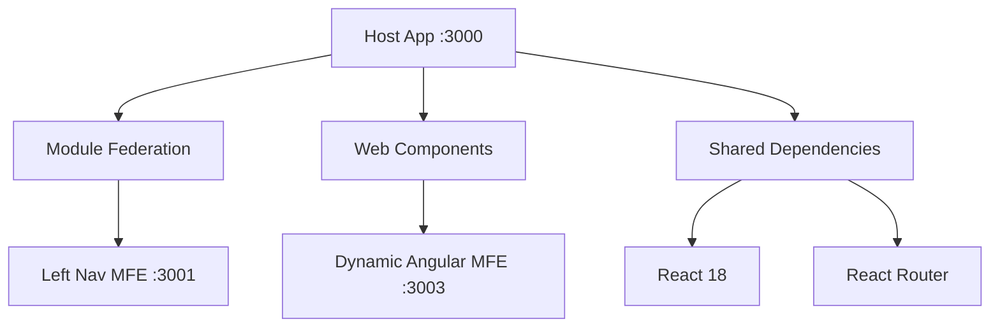

# MFE Host Application

A comprehensive React-based host application for managing and integrating multiple Micro Frontends (MFEs) using both Module Federation and Web Components.

## 🚀 Quick Start

```bash
npm install
npm run dev
```

Application will be available at: **http://localhost:3000**

## 📦 Project Structure

```
host-app/
├── src/
│   ├── components/
│   │   ├── MFELoader.tsx              # Universal MFE loader
│   │   ├── ModuleFederationLoader.tsx # Module Federation handler
│   │   └── WebComponentLoader.tsx     # Web Component handler
│   ├── config/
│   │   └── mfeConfig.ts               # MFE configuration registry
│   ├── hooks/
│   │   └── useWebComponentLoader.ts   # Web component loading hook
│   ├── pages/
│   │   ├── HomePage.tsx               # Landing page
│   │   ├── LeftNavPage.tsx            # Module Federation MFE page
│   │   └── DynamicAngularPage.tsx     # Web Component MFE page
│   ├── types/
│   │   └── mfe.types.ts               # TypeScript definitions
│   ├── App.tsx                        # Main application
│   ├── main.tsx                       # Entry point
│   └── App.css                        # Styles
├── vite.config.ts                     # Vite + Module Federation config
├── tsconfig.json                      # TypeScript configuration
└── package.json
```

## 🎯 Features

### 1. **Dual MFE Type Support**
- ✅ Module Federation MFEs (React + Vite)
- ✅ Native Web Component MFEs (Angular, React, Vue, etc.)

### 2. **Dynamic Runtime Loading**
- On-demand MFE loading
- Lazy loading with React Suspense
- Proper error boundaries

### 3. **Integrated Routing**
- React Router DOM v6
- Nested routes support
- Route-based MFE activation

### 4. **Shared Dependency Management**
- React 18 (singleton)
- React DOM (singleton)
- React Router DOM (singleton)

### 5. **Lifecycle Management**
- MFE initialization tracking
- Load state management
- Error handling
- Cleanup on unmount

## 🔧 Configuration

### Adding a New Module Federation MFE

Edit `src/config/mfeConfig.ts`:

```typescript
export const mfeConfig = {
  // ... existing config
  newMFE: {
    name: 'New MFE',
    type: 'module-federation',
    url: 'http://localhost:3002',
    scope: 'newMFE',
    module: './Component',
  },
};
```

Update `vite.config.ts`:

```typescript
remotes: {
  // ... existing remotes
  newMFE: {
    type: 'module',
    name: 'newMFE',
    entry: 'http://localhost:3002/assets/remoteEntry.js',
    entryGlobalName: 'newMFE',
    shareScope: 'default',
  },
}
```

### Adding a New Web Component MFE

Edit `src/config/mfeConfig.ts`:

```typescript
export const mfeConfig = {
  // ... existing config
  webCompMFE: {
    name: 'Web Component MFE',
    type: 'web-component',
    url: 'http://localhost:3004',
    elementName: 'my-web-component',
    manifestUrl: 'http://localhost:3004/bundle.js',
  },
};
```

## 📋 MFE Registry

Current MFEs:

| Name | Type | Port | Framework | Status |
|------|------|------|-----------|--------|
| Left Navigation | Module Federation | 3001 | React + Vite | ✅ Active |
| Dynamic Angular | Web Component | 3003 | Angular 20 | ✅ Active |

## 🔗 Integration Points

### Module Federation MFEs

```typescript
import { MFELoader } from '../components/MFELoader';
import { getMFEConfig } from '../config/mfeConfig';

const config = getMFEConfig('leftNav');
<MFELoader config={config} />
```

### Web Component MFEs

```typescript
<MFELoader
  config={config}
  componentName="dashboard"
  showHeader={true}
  basePath="/dynamic-angular"
/>
```

## 🎨 Architecture



## 🛠️ Development

### Prerequisites
- Node.js 22+
- npm 10+

### Commands

```bash
# Development
npm run dev              # Start dev server on port 3000

# Production
npm run build            # Build for production
npm run preview          # Preview production build

# Linting
npm run lint             # Run ESLint
```

### Environment Ports

- Host Application: **3000**
- Left Nav MFE: **3001**
- Dynamic Angular MFE: **3003**

## 🔍 Key Components

### MFELoader
Universal loader that handles both MFE types:
- Detects MFE type from configuration
- Routes to appropriate loader
- Handles errors and fallbacks

### ModuleFederationLoader
- Dynamic imports using template literals
- Suspense boundaries
- Error recovery

### WebComponentLoader
- Script injection
- Custom element registration
- Attribute management
- Lifecycle handling

## 🐛 Troubleshooting

### Module Federation Issues
1. Ensure remote MFE is running
2. Check `vite.config.ts` remote URLs
3. Verify exposed modules match import paths
4. Check browser console for federation errors

### Web Component Issues
1. Verify web component server is running
2. Check custom element name matches
3. Ensure script URL is correct
4. Check browser console for registration errors

## 📚 Technology Stack

- **Framework**: React 18.3
- **Build Tool**: Vite 6.0
- **Module Federation**: @module-federation/vite 1.0.10
- **Routing**: React Router DOM 6.26
- **Language**: TypeScript 5.6
- **Styling**: CSS3

## 🎓 Best Practices

1. **Always use the MFELoader** component for consistency
2. **Configure MFEs centrally** in mfeConfig.ts
3. **Handle errors gracefully** with fallbacks
4. **Log lifecycle events** for debugging
5. **Keep shared dependencies in sync** across all MFEs
6. **Test MFE integration** before deployment
7. **Document new MFEs** in the registry

## 🔐 Security Considerations

- All MFE URLs should use HTTPS in production
- Implement CSP headers for web components
- Validate MFE manifests before loading
- Sanitize props passed to MFEs
- Use CORS appropriately

## 🚢 Production Deployment

1. Build all MFEs individually
2. Build host application: `npm run build`
3. Deploy dist folder to CDN/static hosting
4. Update MFE URLs in production config
5. Test cross-origin resource loading
6. Monitor performance and errors

## 📞 Support

For issues or questions:
1. Check the troubleshooting section
2. Review MFE configuration
3. Check browser console logs
4. Verify all services are running

---

**Version**: 1.0.0  
**Last Updated**: 2025-10-31  
**Framework**: React 18 + Vite + Module Federation
